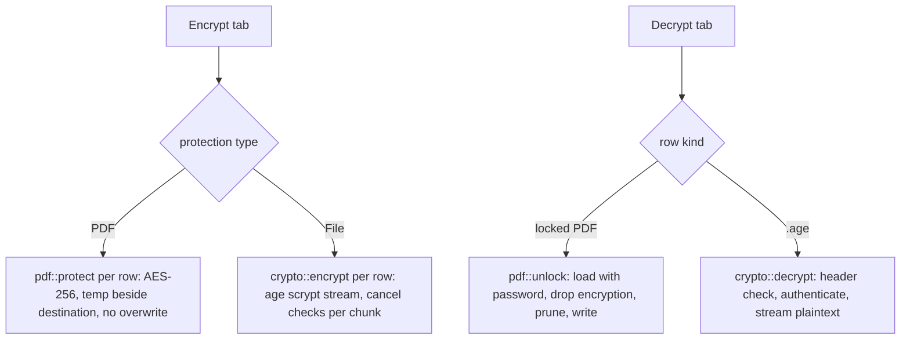

# Encryption And Decryption

The Encrypt tab offers two protections. *Password-protected PDF* adds an open password that any PDF reader asks for. *Encrypted file* wraps any file in a standard `.age` container. The Decrypt tab reverses both: a locked PDF becomes an unlocked copy, an `.age` file becomes its original bytes.

Owning files:

- `crates/core/src/crypto.rs` - `encrypt`, `decrypt` (age)
- `crates/core/src/pdf.rs` - `protect`, `unlock`
- `crates/core/src/job.rs` - `Action::Protect`, `Unlock`, `Encrypt`, `Decrypt`
- `apps/desktop/src-tauri/src/main.rs` - `check_password`, mode to action mapping
- `apps/desktop/src/App.tsx` - the tabs and password fields

## Password-protected PDF

- Eligible rows: PDFs that do not already need a password. Other rows show `PDF required` or `Already protected` and are skipped.
- Password: 12 characters or more, confirmed. The same password protects every selected PDF in the batch.
- Output: `<stem>-protected.pdf`, AES-256. Details in [`PDF_TOOLS.md`](PDF_TOOLS.md).
- The Convert tab can do the same as part of a conversion with its *Password-protect PDFs* switch, including for a combined document.

## Encrypted file

- Library: the Rust `age` crate 0.11, passphrase recipient (scrypt). Output opens in `age`, `rage` and compatible tools with the same password.
- Streaming in 64 KiB chunks; memory does not grow with file size.
- Any file is eligible, including PDFs and files the app cannot otherwise read.
- Output: `<full name>.age`.

## Decrypt

- A locked PDF (detected from the file, shown as `locked` in the queue) is unlocked with `pdf::unlock` to `<stem>-unlocked.pdf`. Wrong password: `Incorrect password or damaged PDF.`
- An `.age` file is restored to `restored-<name without .age>`. Only password-encrypted age files are supported; a file encrypted to a public key fails with a clear message.
- Rows that are neither show `No password set` or `Unsupported file`.
- Files with different passwords belong in different batches: one password field serves the whole batch, and an item whose password does not match fails while the others succeed.

## Password rules

The 12-character minimum counts Unicode scalar values on both sides: `chars().count()` in Rust and `[...password].length` in TypeScript. Backend validation in `check_password` runs before any dialog opens; the UI also disables the action until the rule holds. Decrypt requires a non-empty password.

## Flows

In every path the temp file is dropped on error or cancel, and nothing appears at the destination.

## Error messages

| Situation | Message |
| --- | --- |
| New password under 12 chars | `Use a password with at least 12 characters.` |
| Decrypt with empty password | `Enter the password.` |
| Source is not an age file | `Not a supported age encrypted file.` |
| Age file uses a key recipient | `This build supports password-encrypted age files only.` |
| Wrong age password or damaged header | `Incorrect password or damaged encrypted file.` |
| Wrong PDF password | `Incorrect password or damaged PDF.` |
| PDF has no password | `This PDF has no password.` |
| PDF already protected | `This PDF already has a password. Unlock it first, then protect it again.` |
| Destination exists | `Output already exists. Choose another name.` |
| Cancelled | `Cancelled. No output was saved.` |

## UI behaviour

- Encrypt shows the protection choice, then a password field with Show/Hide, a confirmation field, the hint `Use at least 12 characters. A longer phrase is easier to remember.`, a live `Passwords do not match.` error and the warning that the password cannot be recovered.
- Decrypt shows one password field and the info card `Unlock your documents`.
- Show/Hide toggles both fields together. Fields are cleared after every job and on every tab change.

## Tests

- `crypto::tests::crypto_roundtrip_wrong_password_and_truncation` - byte-identical round trip, wrong password leaves no output, existing destination refused, truncated ciphertext refused
- `pdf::tests::protect_unlock_and_merge` - protect, wrong password, unlock, double protection refused
- `job::tests::builtin_routes_run_without_office` - encrypt through the batch runner and a protected merge

## Not implemented

- key-based age recipients
- folder or archive encryption
- a generic output name to hide the original file name
- owner passwords and permission flags on PDFs
- secure erase of temp files on SSDs
