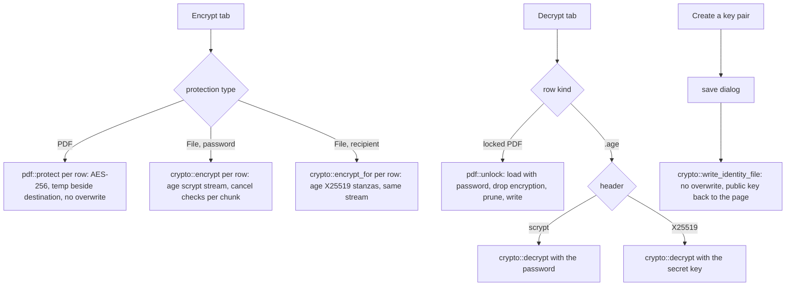

# Encryption And Decryption

The Encrypt tab offers three protections. *Password-protected PDF* adds an open password that any PDF reader asks for. *Encrypted file* wraps any file in a standard `.age` container that a password opens. *Encrypted file for a recipient* wraps any file in a `.age` container that only the holder of a matching secret key opens; no password is shared. The Decrypt tab reverses all three: a locked PDF becomes an unlocked copy, an `.age` file becomes its original bytes, with the password or with the secret key.

Owning files:

- `crates/core/src/crypto.rs` - `encrypt`, `encrypt_for`, `decrypt`, `parse_recipients`, `parse_identity`, `write_identity_file` (age)
- `crates/core/src/pdf.rs` - `protect`, `unlock`
- `crates/core/src/job.rs` - `Action::Protect`, `Unlock`, `Encrypt`, `EncryptFor`, `Decrypt`; `Batch.recipients`, `Batch.identity`
- `apps/desktop/src-tauri/src/main.rs` - `check_password`, `parse_keys`, `create_key_pair`, mode to action mapping
- `apps/desktop/src/App.tsx` - the tabs, password fields, recipient list, secret key field and key pair card

## Password-protected PDF

- Eligible rows: PDFs that do not already need a password. Other rows show `PDF required` or `Already protected` and are skipped.
- Password: 12 characters or more, confirmed. The same password protects every selected PDF in the batch.
- Output: `<stem>-protected.pdf`, AES-256. Details in [`PDF_TOOLS.md`](PDF_TOOLS.md).
- The Convert tab can do the same as part of a conversion with its *Password-protect PDFs* switch, including for a combined document.

## Encrypted file

- Library: the Rust `age` crate 0.11, passphrase recipient (scrypt). Output opens in `age`, `rage` and compatible tools with the same password.
- Streaming in 64 KiB chunks; memory does not grow with file size.
- Any file is eligible, including PDFs and files the app cannot otherwise read.
- Output: `<full name>.age`.

## Encrypted file for a recipient

- Same library, X25519 recipients: the standard `age1…` public keys that `age-keygen` and `rage-keygen` produce. Output opens in `age`, `rage` and compatible tools with the matching secret key.
- The Encrypt tab takes the public keys in a text box, one per line. Blank lines and lines starting with `#` are ignored; duplicates are dropped; at most 20 keys. A line that holds a secret key, or that is not an `age1…` key, is refused with its line number before any dialog opens.
- No password is needed and none is asked for. The sender cannot open the output unless their own public key is in the list; *Add my public key* puts the key from the key pair card into the list.
- Any file is eligible. Output: `<full name>.age`, the same name as for a password file. The age header records which kind it is.
- Behind the scenes: `Action::EncryptFor` and `crypto::encrypt_for`, which refuses an empty list. `Batch.recipients` carries parsed `age::x25519::Recipient` values, never strings.

## Your key pair

The recipient needs a key pair. *Create a key pair* on the Encrypt tab (recipient mode) and on the Decrypt tab calls `create_key_pair`:

1. A native save dialog asks where to put the secret key; the suggested name is `age-secret-key.txt`. Cancel returns nothing.
2. The backend generates an X25519 identity and writes the standard age key file through the no-overwrite temp path: a `# created:` line, a `# public key:` line, then the `AGE-SECRET-KEY-1…` line.
3. The command holds the busy flag, so no batch starts while the dialog is open. Only the public key and the file's location return to the page. The page shows the public key with *Copy*, the saved path, and the warning that the file cannot be recovered and opens every file encrypted to that key.

The key file inherits the permissions of its folder; the app does not restrict them. Keep it out of shared folders. The secret key is never displayed and is not kept in the app after the file is written.

## Decrypt

- A locked PDF (detected from the file, shown as `locked` in the queue) is unlocked with `pdf::unlock` to `<stem>-unlocked.pdf`. Wrong password: `Incorrect password or damaged PDF.`
- An `.age` file is restored to `restored-<name without .age>`. The header decides what opens it: a password file uses the *Document password* field, a file for a recipient uses the *Secret key* field. Offering the wrong kind fails with a message that names the kind the file needs.
- The *Secret key* field takes the bare `AGE-SECRET-KEY-1…` line or the whole key file pasted in. The field is a single line, so a pasted file loses its line breaks; the key is found by its `AGE-SECRET-KEY-1` prefix wherever it sits, and `#` comments are skipped. A public key pasted there is refused. The field is cleared after every job and on every tab change, like the password.
- Rows that are neither a locked PDF nor an `.age` file show `No password set` or `Unsupported file`.
- One password and one secret key serve the whole batch; an item that neither opens fails while the others succeed. Files with different passwords belong in different batches.

## Password rules

The 12-character minimum counts Unicode scalar values on both sides: `chars().count()` in Rust and `[...password].length` in TypeScript. Backend validation in `check_password` runs before any dialog opens; the UI also disables the action until the rule holds. Recipient mode needs no password. Decrypt requires a password or a secret key; `parse_keys` parses the recipient list and the secret key, also before any dialog.

## Flows

In every path the temp file is dropped on error or cancel, and nothing appears at the destination.

## Error messages

| Situation | Message |
| --- | --- |
| New password under 12 chars | `Use a password with at least 12 characters.` |
| Decrypt with nothing entered | `Enter the password or the secret key.` |
| Recipient mode with no key | `Enter at least one public key.` |
| A recipient line is not a public key | `Line N: not an age public key. A public key starts with age1.` |
| A recipient line is a secret key | `Line N: this is a secret key. Enter the public key that starts with age1.` |
| More than 20 keys | `At most 20 public keys are allowed.` |
| Secret key field holds a public key | `This is a public key. Enter the secret key that starts with AGE-SECRET-KEY-1.` |
| Secret key field holds something else | `Not an age secret key. A secret key starts with AGE-SECRET-KEY-1.` |
| Source is not an age file | `Not a supported age encrypted file.` |
| Password file, no password given | `This file was encrypted with a password. Enter the password.` |
| Recipient file, no secret key given | `This file was encrypted to a public key. Enter the matching secret key.` |
| Secret key does not open the file | `The secret key does not match this file.` |
| Recipient file damaged | `Damaged encrypted file.` |
| Wrong age password or damaged header | `Incorrect password or damaged encrypted file.` |
| Wrong PDF password | `Incorrect password or damaged PDF.` |
| PDF has no password | `This PDF has no password.` |
| PDF already protected | `This PDF already has a password. Unlock it first, then protect it again.` |
| Destination exists | `Output already exists. Choose another name.` |
| Cancelled | `Cancelled. No output was saved.` |

## UI behaviour

- Encrypt shows three protection cards. The password modes show a password field with Show/Hide, a confirmation field, the hint `Use at least 12 characters. A longer phrase is easier to remember.`, a live `Passwords do not match.` error and the warning that the password cannot be recovered. Recipient mode replaces them with the *Recipient public keys* box and the key pair card.
- Decrypt shows the info card `Unlock your documents`, the password field, the *Secret key* field and the key pair card. The action is enabled when either field has text.
- Show/Hide toggles the password, confirmation and secret key fields together. Secret fields are cleared after every job and on every tab change. The recipient list and the shown public key stay; they are not secret.
- Rows: recipient mode accepts every file, like password mode. The output column reads `.age`.

## Tests

- `crypto::tests::crypto_roundtrip_wrong_password_and_truncation` - byte-identical round trip, wrong password leaves no output, existing destination refused, truncated ciphertext refused
- `crypto::tests::public_key_roundtrip_needs_the_matching_secret_key` - two recipients parsed from text with comments and duplicates, either secret key restores the bytes, a password or an unrelated key leaves no output, a password file refuses a key, an empty recipient list is refused, truncation refused
- `crypto::tests::key_text_parsing_rejects_the_wrong_kind_of_key` - line-numbered errors, a secret key in the recipient box, 21 keys, a whole key file with CRLF in the secret key box, the same file flattened to one line, a lowercase key, a public key in the secret key box
- `crypto::tests::identity_file_is_standard_and_never_overwritten` - key file layout, parses back to the same public key, second write refused
- `job::tests::public_key_encryption_runs_through_the_batch` - a recipient batch fails without keys and never falls back to the password, succeeds with a key; restore fails with the password and succeeds with the secret key
- `pdf::tests::protect_unlock_and_merge` - protect, wrong password, unlock, double protection refused
- `job::tests::builtin_routes_run_without_office` - encrypt through the batch runner and a protected merge
- desktop `tests::public_key_mode_needs_keys_instead_of_a_password` - `check_password` and `parse_keys` per mode: no password in recipient mode, a key file refused as a recipient, a secret key accepted from a whole key file, password mode unchanged

## Not implemented

- SSH keys, age plugins and other recipient types beyond X25519 and passphrase
- reading the secret key from a file picker; it is pasted like a password
- showing, before the job, whether a queued `.age` file needs a password or a key
- folder or archive encryption
- a generic output name to hide the original file name
- owner passwords and permission flags on PDFs
- secure erase of temp files on SSDs
- restricting the key file's permissions on Windows
