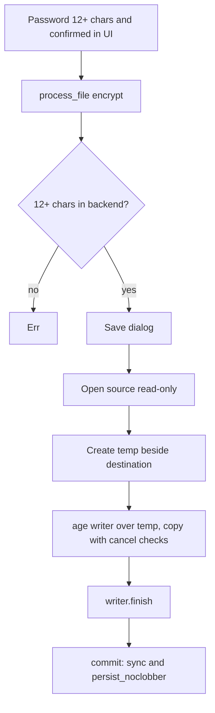
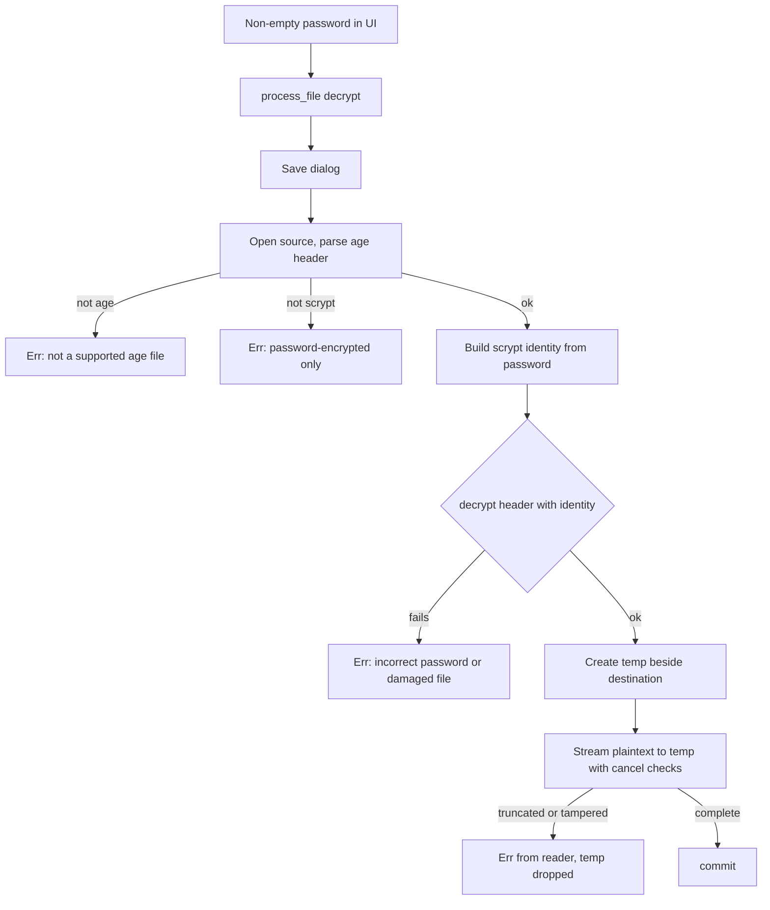

# Encryption And Decryption

Encrypt makes a standard `.age` copy of any file, locked with a password. Decrypt turns that copy back into the original bytes. This is file encryption. It does not add a password that a PDF reader understands; that is a separate planned feature using qpdf.

Owning files:

- `crates/core/src/lib.rs` - `encrypt`, `decrypt`, `secret`, `copy_cancel`
- `apps/desktop/src-tauri/src/main.rs` - password length check, suggested names
- `apps/desktop/src/main.tsx` - Encrypt and Decrypt tabs, password fields

## Format

- Library: the Rust `age` crate, version 0.11.
- Recipient: `Encryptor::with_user_passphrase`, which uses scrypt. Output is readable by `age`, `rage`, and other compatible tools with the same password.
- Streaming: input is copied in 64 KiB chunks through the age writer. Memory use does not grow with file size.
- Suggested name: `<original name>.age`. Decrypt suggests `restored-<name without .age>`.

## Encrypt flow

The 12-character rule counts Unicode scalar values on both sides: `chars().count()` in Rust and `[...password].length` in TypeScript. A shorter password is rejected before any dialog opens.

## Decrypt flow

The password check happens at the header, so a wrong password fails fast. Truncation or tampering in the body fails during the stream. In both cases the temp file is dropped and nothing appears at the destination.

The backend does not enforce a minimum length for decrypt. The UI requires at least one character.

## Error messages

| Situation | Message |
| --- | --- |
| Password under 12 chars on encrypt | `Use a password with at least 12 characters.` |
| Source is not an age file | `Not a supported age encrypted file.` |
| Age file uses a key recipient | `This build supports password-encrypted age files only.` |
| Wrong password or damaged header | `Incorrect password or damaged encrypted file.` |
| Destination exists | `Output already exists. Choose another name.` |
| Cancelled | `Cancelled. No output was saved.` |

## UI behaviour

- Encrypt shows a password field with Show/Hide, a confirmation field, and the hint `At least 12 characters. Keep it safe; there is no password recovery.` A live `Passwords do not match.` error appears once the confirmation differs.
- Decrypt shows one password field and accepts only files ending in `.age`.
- Show/Hide toggles both fields together.
- Both fields are cleared after every job and on every tab change.
- The info box explains the difference between file encryption and a PDF-open password.

## Tests

`crypto_roundtrip_wrong_password_and_truncation` in `crates/core/src/lib.rs` covers:

- byte-identical round trip including NUL and non-UTF-8 bytes
- wrong password leaves no output
- encrypting onto an existing `.age` destination fails
- a truncated ciphertext fails and leaves no partial plaintext

## Not implemented

- PDF password protection and removal (qpdf)
- key-based age recipients
- folder or archive encryption
- a generic output name to hide the original file name
- secure erase of temp files on SSDs
