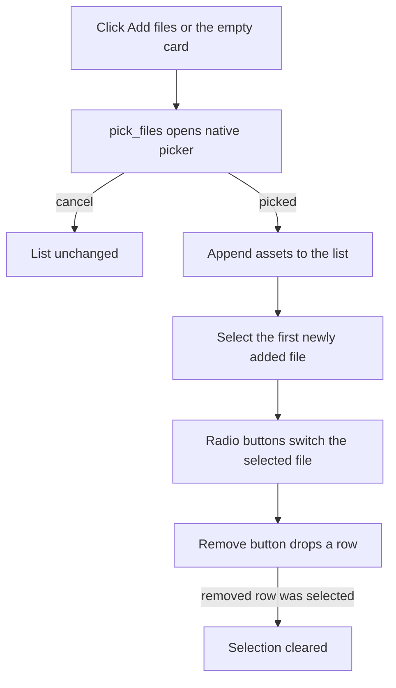

# File Queue

The left column of the workspace lists the files the user has picked. In this build the queue is a single-selection list: many files can be listed, but one file is processed per job.

Owning files:

- `apps/desktop/src/main.tsx` - `files`, `selected`, `add()`, the list markup
- `apps/desktop/src-tauri/src/main.rs` - `pick_files`

## Behaviour

- **Add files** appends. It never replaces the list. Picking the same file twice creates two rows with different IDs.
- **Selection** is a radio group named `file`. Changing it clears the message and error area.
- **Remove** filters the row out of React state only. The backend keeps the path until exit.
- **Count badge** in the heading shows the number of rows.
- **Empty state** is one large dashed button. Its subtitle names the accepted types for the current operation:
  - Images: `PNG, JPG and BMP`
  - Decrypt: `Password-encrypted .age files`
  - Encrypt: `Any document or file`
- Every row shows the file name and size in KB with one decimal.
- All controls are disabled while a job runs. Add is also disabled outside the desktop app.

## Type gating

The queue accepts any file. Suitability is checked at the selected file, by extension, when the primary action is evaluated:

| Operation | Accepted extension |
| --- | --- |
| image | `.png`, `.jpg`, `.jpeg`, `.bmp` |
| decrypt | `.age` |
| encrypt | anything |

A selected file that does not match shows `This file type is not supported for the selected operation.` and disables the action. The core repeats the check on real content for images and on the age header for decryption, so a renamed file still fails safely.

## Differences from the accepted design

The [design reference](DESIGN_REFERENCE.md) shows a richer queue. Not yet implemented:

- multi-select with checkboxes, select-all, and a selection count
- per-row output format dropdown
- per-row status column (`Ready`, `Queued`, `Unsupported file`)
- drag-and-drop zone
- `Clear all`
- `Load example files`
- a table layout with a type badge per row

The current list keeps the same section heading, count badge, and footnote text so it can grow into the table without a redesign.
