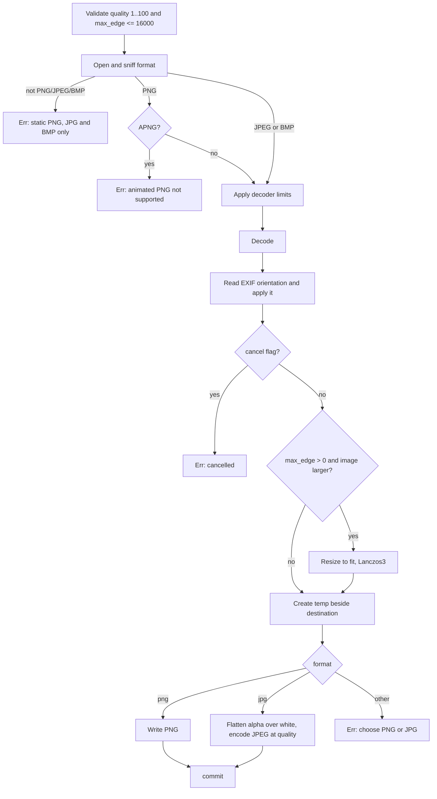

# Image Conversion

The Images tab converts one static image to PNG or JPG. It can shrink the image to fit a square bound, set JPEG quality, and it always applies EXIF orientation.

Owning files:

- `crates/core/src/lib.rs` - `convert_image`
- `apps/desktop/src/main.tsx` - Images tab, format, resize, and quality controls

## Supported formats

| Direction | Formats | Notes |
| --- | --- | --- |
| Input | PNG, JPEG, BMP | Detected by content sniffing, not extension |
| Output | PNG, JPG | `format` argument is `"png"` or `"jpg"` |

Only these three decoders are compiled into the `image` crate (`default-features = false`). Animated PNG is detected and rejected. WebP, TIFF, GIF, HEIC, and AVIF are not available.

## Pipeline

## Rules

- **Resize** fits within `max_edge × max_edge` and keeps aspect ratio. Smaller images are never enlarged. `max_edge = 0` keeps the original size. The UI offers 1920, 1280, and 640.
- **Orientation** from EXIF is applied before resize, so a portrait phone photo comes out upright.
- **JPG output** has no alpha channel. Each pixel is blended over white using its alpha value, with rounding. Fully transparent areas become white.
- **Quality** applies to JPG only. The UI slider is disabled for PNG. Default is 85.
- **Metadata** is not copied. The encoders write pixel data only, so EXIF, GPS, and ICC profiles are dropped. Colour values are not converted; a CMYK JPEG or a wide-gamut ICC image may shift.
- **Limits**: width and height up to 16000 px, decoder allocation up to 256 MiB. Larger inputs fail before decoding completes.
- **Cancel** is checked once after decode and once before commit. A slow decode or encode finishes first.

## Error messages

| Situation | Message |
| --- | --- |
| Quality outside 1..100 or max_edge over 16000 | `Invalid image settings.` |
| Unsupported or unreadable format | `This build converts static PNG, JPG and BMP inputs.` |
| Animated PNG | `Animated PNG is not supported; no frames were discarded.` |
| Output format not png or jpg | `Choose PNG or JPG output.` |
| Decoder limit hit | The `image` crate error text |

## UI behaviour

- Output format select: `PNG · lossless` or `JPG · smaller files`.
- Resize select: `Original dimensions` or `Fit within N × N`.
- Quality range 1 to 100, label shows the current percent, disabled unless JPG.
- Hint text states the aspect ratio, white background, stripped metadata, and missing colour-profile handling.
- The selected file must end in `.png`, `.jpg`, `.jpeg`, or `.bmp`.
- Suggested output name: `<stem>-converted.<format>`.

## Tests

`image_resize_and_cancel_preserve_source` in `crates/core/src/lib.rs` covers:

- an 80×40 transparent red PNG converted to JPG at `max_edge = 20` comes out 20×10
- the transparent pixel becomes near-white after flattening
- the source bytes are unchanged
- a pre-set cancel flag fails the job and leaves no output

## Not implemented

- WebP and TIFF input or output
- image to PDF
- colour-profile conversion to sRGB
- choice of background colour for flattening
- metadata preservation option
- batch conversion
