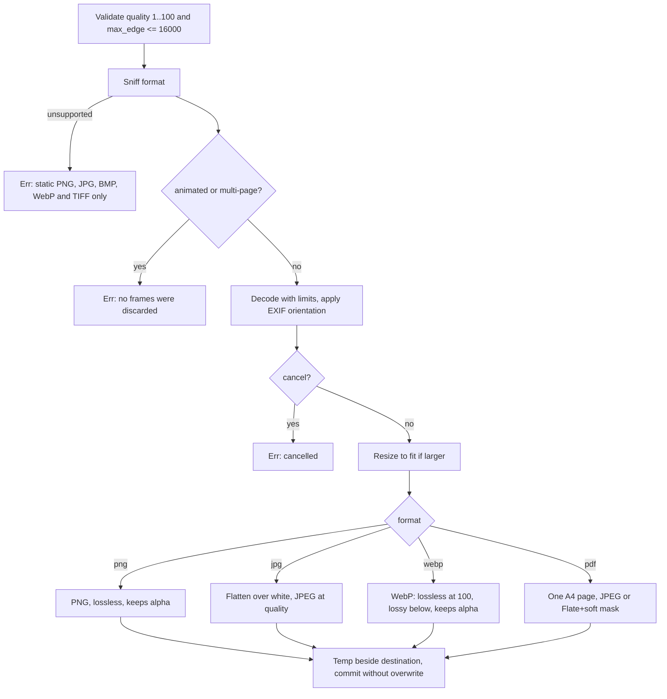

# Image Conversion

The Images tab converts every selected image to PNG, JPG, WebP or a one-page A4 PDF. It can shrink images to fit a square bound, sets quality for lossy outputs, and always applies EXIF orientation.

Owning files:

- `crates/core/src/images.rs` - `inspect_image`, `decode`, `resize`, `encode`, `convert_image`
- `crates/core/src/pdf.rs` - `image_pdf`
- `apps/desktop/src/App.tsx` - Images tab, per-row format, quality and resize controls

## Supported formats

| Direction | Formats | Notes |
| --- | --- | --- |
| Input | PNG, JPEG, BMP, WebP, TIFF | Detected by content, not extension |
| Output | PNG, JPG, WebP, PDF | Per row, or the batch select applies to all selected images |

Only these decoders are compiled into the `image` crate. Animated PNG, animated WebP and multi-page TIFF are detected and rejected before decoding so no frame or page is silently dropped. GIF, HEIC and AVIF are not available.

## Pipeline

## Rules

- **Resize** fits within `max_edge × max_edge` and keeps the aspect ratio. Smaller images are never enlarged. `0` keeps the original size. The UI offers 1920, 1280 and 640.
- **Orientation** from EXIF is applied before resize, so a portrait phone photo comes out upright.
- **Quality** 10 to 100 in the UI applies to JPG, WebP and PDF. WebP at 100 is lossless; below that it is lossy. PNG ignores it.
- **Transparency**: PNG and WebP keep it. JPG flattens over white. PDF keeps it through a soft mask; opaque images become JPEG inside the PDF.
- **Metadata** is not copied. EXIF, GPS and ICC profiles are dropped. Colour values are not converted; a CMYK JPEG or a wide-gamut image may shift.
- **Limits**: width and height up to 16000 px, decoder allocation up to 256 MiB. Larger inputs fail before decoding completes.
- **PDF page**: A4, landscape when the image is wider than tall, 10 mm margin, never scaled above one pixel per point, centred. See [`PDF_TOOLS.md`](PDF_TOOLS.md).

## Error messages

| Situation | Message |
| --- | --- |
| Quality outside 1..100 or max_edge over 16000 | `Invalid image settings.` |
| Unsupported or unreadable format | `This build converts static PNG, JPG, BMP, WebP and TIFF inputs.` |
| Animated PNG | `Animated PNG is not supported; no frames were discarded.` |
| Animated WebP | `Animated WebP is not supported; no frames were discarded.` |
| Multi-page TIFF | `Multi-page TIFF is not supported; no pages were discarded.` |
| Unknown output format | `Choose PNG, JPG, WebP or PDF output.` |
| Decoder limit hit | The `image` crate error text |

## UI behaviour

- The batch format select (PNG, JPG, WEBP, PDF) applies to every selected image; each row can differ.
- Quality slider 10 to 100 with the current percent, disabled while no selected row has a lossy output.
- Resize select: `Original dimensions` or `Fit within N × N`.
- The queue shows `width × height` for each image.
- Output names: `<stem>.<png, jpg, webp or pdf>`; several files go to a chosen folder with numbered names on collision.

## Tests

In `crates/core/src/images.rs`:

- `image_resize_and_cancel_preserve_source` - 80×40 transparent PNG to a 20×10 JPG, pixel flattened to white, source unchanged, cancel leaves no file
- `webp_and_tiff_roundtrip_and_pdf_output` - lossless WebP keeps alpha and size, lossy WebP encodes, TIFF page count and decode, PDF output has one page and refuses to overwrite

## Not implemented

- Several images into one combined PDF (the core supports it; the UI does not offer it)
- colour-profile conversion to sRGB
- choice of background colour for flattening
- metadata preservation option
- GIF, HEIC and AVIF
