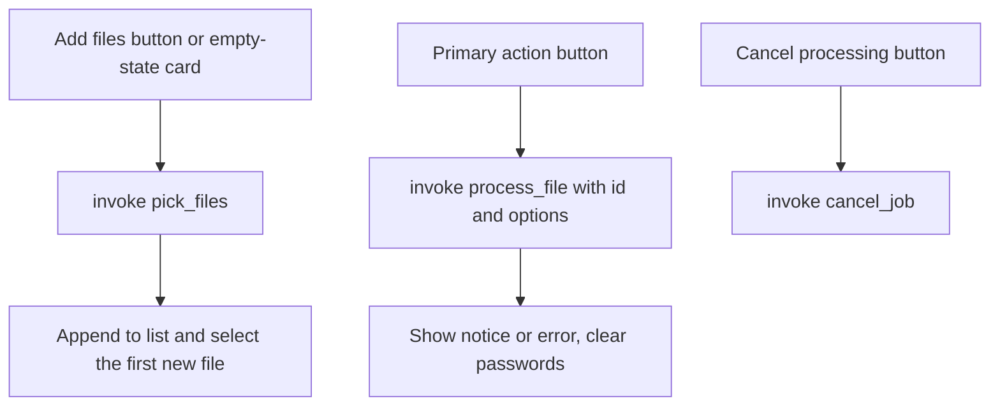

# IPC Commands And File Access

The frontend talks to Rust through three Tauri commands. It never receives or sends a filesystem path. The backend mints an opaque ID for each picked file and only accepts those IDs back.

Owning files:

- `apps/desktop/src-tauri/src/main.rs` - commands and `AppState`
- `apps/desktop/src/main.tsx` - the `invoke` call sites

## Why IDs instead of paths

- No Tauri filesystem or dialog plugin is enabled. The webview cannot open, read, or list files on its own.
- The path map lives in Rust. Even a compromised page can only name IDs the user already picked.
- The save location comes from a native dialog run by Rust, so the page cannot choose it either.

This matches section 4 of the [application plan](APPLICATION_PLAN.md): file contents and arbitrary paths must not travel through UI state.

## Commands

### `pick_files() -> Vec<Asset>`

1. Fails with `A job is running` if `busy` is set.
2. Opens the native multi-select file picker with `rfd`.
3. For each picked entry: canonicalizes the path, reads metadata, skips anything that is not a regular file.
4. Mints an ID from the `next` counter, stores `id -> path`, and returns `{ id, name, bytes }`.

Returns an empty list when the user cancels. There is no file type filter in the dialog; the UI decides afterwards whether the selected file suits the operation.

### `process_file(id, operation, password, format, max_edge, quality) -> String`

Runs one job. See [`JOB_LIFECYCLE.md`](JOB_LIFECYCLE.md) for the full flow.

| Argument | Used by | Notes |
| --- | --- | --- |
| `id` | all | Must be a key in the file map, else `Select the file again` |
| `operation` | all | `encrypt`, `decrypt`, or `image`; anything else is `not implemented yet` |
| `password` | encrypt, decrypt | Encrypt requires 12 or more chars. Image sends an empty string. |
| `format` | image | `png` or `jpg` |
| `max_edge` | image | `0` keeps size; otherwise fit within a square of this size |
| `quality` | image | `1` to `100`, JPEG only |

The frontend passes `maxEdge`; Tauri maps camelCase arguments to the snake_case parameter.

The success string is either `Saved <path>` or `Save cancelled. No output created.` Both resolve the promise. Errors reject with a `String`.

### `cancel_job()`

Sets the cancel flag. Returns immediately. Safe to call at any time.

## Frontend call sites



All three calls are wrapped in `try/catch` and any rejection is shown as the error string.

## Asset shape

```typescript
type Asset = { id: string; name: string; bytes: number };
```

`name` is the file name only, never the directory. `bytes` is shown as KB with one decimal.

## Browser preview

When `isTauri()` is false, the UI shows a notice and disables Add and the primary action. `invoke` would throw outside Tauri, so this guard keeps the Vite dev page usable for layout work.

## Not exposed

- reading file contents into the page
- listing directories
- deleting or overwriting files
- opening the output after save
- drag and drop from Explorer (the mockup has a drop zone; the app does not)
