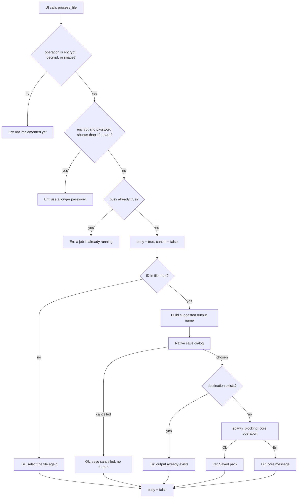
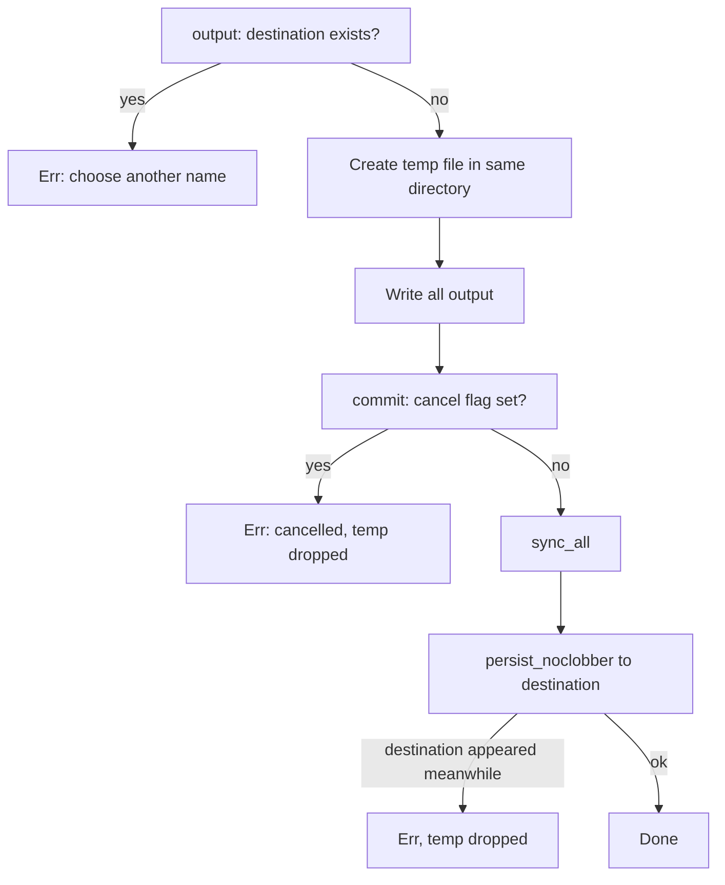

# Job Lifecycle

A job is one call to the `process_file` command for one input file. The app runs at most one job at a time. Every job ends in exactly one of three ways: a saved output, an error with no output, or a cancelled save dialog with no output.

Owning files:

- `apps/desktop/src-tauri/src/main.rs` - `process_file`, `cancel_job`, `AppState`
- `crates/core/src/lib.rs` - `copy_cancel`, `output`, `commit`, and the three operations

## Flow

The early checks for operation name, password length, and busy state happen before `busy` flips, so a rejected call never blocks a later one.

## Suggested output names

| Operation | Suggested name |
| --- | --- |
| encrypt | `<source name>.age` |
| decrypt | `restored-<source name without .age>` |
| image | `<source stem>-converted.<png or jpg>` |

The user can change the name in the dialog. The dialog does not restrict the folder.

## Temporary output and commit

Every core operation writes to a `NamedTempFile` created in the destination's parent directory, then moves it into place.

Why the same directory: a rename inside one directory is atomic on the same volume, so the destination either exists complete or not at all.

Why `persist_noclobber`: the existence check in `output()` and in `process_file` runs before the work. If another process creates the destination during the job, the final move still refuses to overwrite.

Dropping a `NamedTempFile` deletes it. That covers normal errors and cancellation. It does not cover a force-killed process or power loss; cleanup of orphaned temp files on next start is not implemented.

## Cancellation

`cancel_job` sets `AppState.cancel` to `true` and returns. It does not wait. The core checks the flag at these points:

- `copy_cancel`: before every 64 KiB chunk during encrypt and decrypt
- `convert_image`: once after decode and orientation, before resize
- `commit`: once before the final move

A stage that is already running finishes first. Examples: scrypt key derivation for age, a single large PNG decode, or the JPEG encode. The UI keeps the Cancel button visible until the command returns.

The flag is reset to `false` when the next job starts. Calling `cancel_job` while idle has no effect on that next job.

## Busy state

`busy` is `true` from the moment the checks pass until the command returns, which includes the time the save dialog is open. While busy:

- `pick_files` returns an error instead of opening the picker
- a second `process_file` returns an error
- the UI disables every control except Cancel

## What the UI shows

| Moment | Message area |
| --- | --- |
| Job started | `Choose a new output filename in the save dialog.` |
| Save dialog cancelled | `Save cancelled. No output created.` as a notice |
| Success | `Saved <full destination path>` as a notice |
| Any error | The error string in a red alert; the notice is cleared |

After every job, success or not, the password and confirmation fields are cleared. The file stays selected so the user can retry.

## Known limits

- One file per job. Batch queues are planned, not implemented.
- No progress percentage. The UI shows a `Working…` label only.
- Cancellation is cooperative, as described above.
- Temp files from a crash are not cleaned up.
