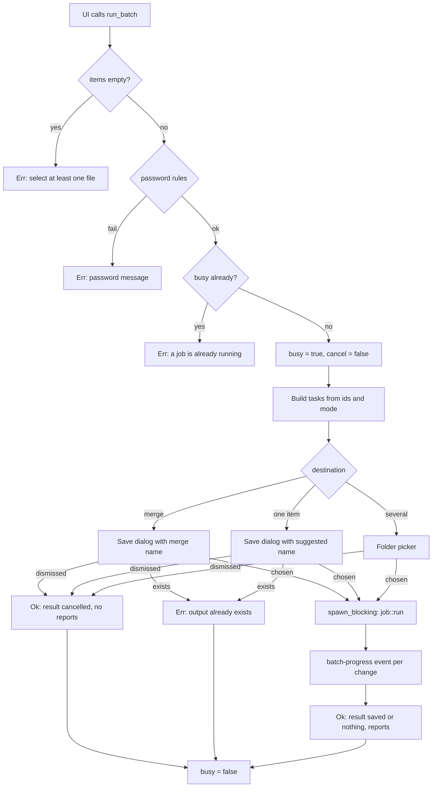

# Job Lifecycle

A job is one call to `run_batch` with one or more queue rows. The app runs one job at a time. Each row ends as saved, failed, or cancelled; the batch as a whole ends as `saved`, `nothing` (no row saved), or `cancelled` (the destination dialog was dismissed).

Owning files:

- `apps/desktop/src-tauri/src/main.rs` - `run_batch`, `cancel_job`, `preview`, `AppState`
- `crates/core/src/job.rs` - `run`, `run_item`, `run_merge`, `convert_document`, work folders
- `crates/core/src/lib.rs` - `output`, `commit`, `copy_file`, `write_bytes`, `unique_path`

## Flow

Checks before `busy` flips never block a later call.

## Tasks

`build_tasks` maps each request item to a `Task` with the canonical source path, its detected kind, and an action:

| Mode | Action |
| --- | --- |
| convert | `Convert { format }` from the row; PDF when combining |
| images | `Image { format }` from the row |
| encrypt, protection `pdf` | `Protect` |
| encrypt, protection `file` | `Encrypt` |
| decrypt, PDF input | `Unlock` |
| decrypt, other input | `Decrypt` |
| clean, DOCX/PDF/image input | `Clean` (no password, no conversion options) |

Page breaks travel per item (`page_breaks`); orientation, margins and spacing are batch-wide. The UI only sends rows that pass the mode's eligibility check, and the core rechecks content (image sniffing, age header, PDF lock status) so a wrong file still fails safely.

## Password rules

Backend and UI agree:

- new passwords (encrypt tab, or convert with *Password-protect PDFs* on and at least one PDF output or a merge): 12 or more Unicode scalar values, confirmed in the UI. With the switch on but only TXT, HTML, DOCX or Markdown outputs, no password is needed and none is asked for.
- decrypt: not empty
- everything else: ignored

## Work folder and commit

`job::run` creates `%TEMP%\doc-converter-<random>` for the batch and removes it when the batch ends. While it exists, a file named `.in-use` inside it is held open with exclusive sharing, so a second instance's startup cleanup can tell that the folder is live. Conversions write there first; the final file is then produced beside its destination with `NamedTempFile` and moved with `persist_noclobber`, so the destination either appears complete or not at all and never overwrites.

- `Destination::File` (single item or merge): the exact path from the save dialog, rejected before work starts if it exists.
- `Destination::Folder`: `unique_path` picks `<stem>.<ext>`, then `<stem> (2).<ext>`, `<stem> (3).<ext>`, … so a rerun never overwrites an earlier result.

At startup the app removes `doc-converter-*` folders left in `%TEMP%` by a crash or a forced exit. A folder whose `.in-use` file cannot be opened belongs to a running instance and is skipped.

Intermediate files that pass through the work folder: edited DOCX copies, LibreOffice output, per-document PDFs before a merge, HTML bridges. They are deleted with the folder. Decrypted plaintext for the Decrypt tab does not pass through it; it streams to the temp file beside the destination as before.

## Per-item execution

Items run one after another. Before each, a `Working` report is sent; after it, `Done` with the output path, `Failed` with the message, or `Cancelled`. When cancellation is detected, the remaining items are reported `Cancelled` without running. A failed item does not stop the batch.

For a combined document all items are converted first (each reported `Working` then `Ready to merge`), then merged, protected if asked, and written once. Any failure fails every item with the same message and nothing is saved.

## Output names

| Action | Name |
| --- | --- |
| Convert | `<stem>.<ext>` |
| Image | `<stem>.<png, jpg, webp or pdf>` |
| Protect | `<stem>-protected.pdf` |
| Unlock | `<stem>-unlocked.pdf` |
| Encrypt | `<full name>.age` |
| Decrypt | `restored-<name without .age>` |
| Clean | `<stem>-clean.docx`, `<stem>-clean.pdf`, or `<stem>-clean.png` for photos |
| Merge | the *Output filename* field, `.pdf` added if missing |

## Cancellation

`cancel_job` sets the flag and returns. The core checks it:

- between items
- before every 64 KiB chunk of a stream copy or age operation
- after decoding an image and before commit
- every 100 ms while LibreOffice runs, then terminates its job object
- before each source while merging, and before each zip entry while rewriting a DOCX
- before and after each conversion step and before every commit

A stage already running in process (a PDF encryption, an image encode, a Typst compile) finishes first; nothing it produced is published. The cancelled item and every item after it report `Cancelled`.

## Busy state

`busy` is true from the checks to the return of `run_batch`, including while a dialog is open. While busy: `pick_files`, `add_paths` and `preview` are refused, a second `run_batch` is refused, and the UI disables every control except Cancel.

Previews do not use `busy`. They run behind their own gate: a new preview cancels the previous one and waits for it to stop; `run_batch` cancels the current preview and holds the gate for the whole batch, so a click on Convert never fails because a preview is rendering.

## Progress events

Each change emits `batch-progress` with `{ index, status, detail, output }`, where `index` is the position in the request's item list. The UI keeps the row ids of the running batch and updates the matching row's status column and the result bar.

## Known limits

- No progress inside one item; LibreOffice stages show only `Working…`.
- A batch that is force-killed leaves its work folder until the next start.
- Items run sequentially; there is no parallel image pool yet.

## Standards export completion

Standards jobs export, optionally embed attachments, then run local veraPDF on the
final work file before committing. Validation failure preserves sources and leaves
no output; `ItemReport.validation` carries failed rules. PDF/UA passing machine
checks remains marked as requiring human review. Cancellation covers validation,
and ordinary no-overwrite commit behavior is retained. Preview is a page-content
preview, not final validation or attachment inspection.
