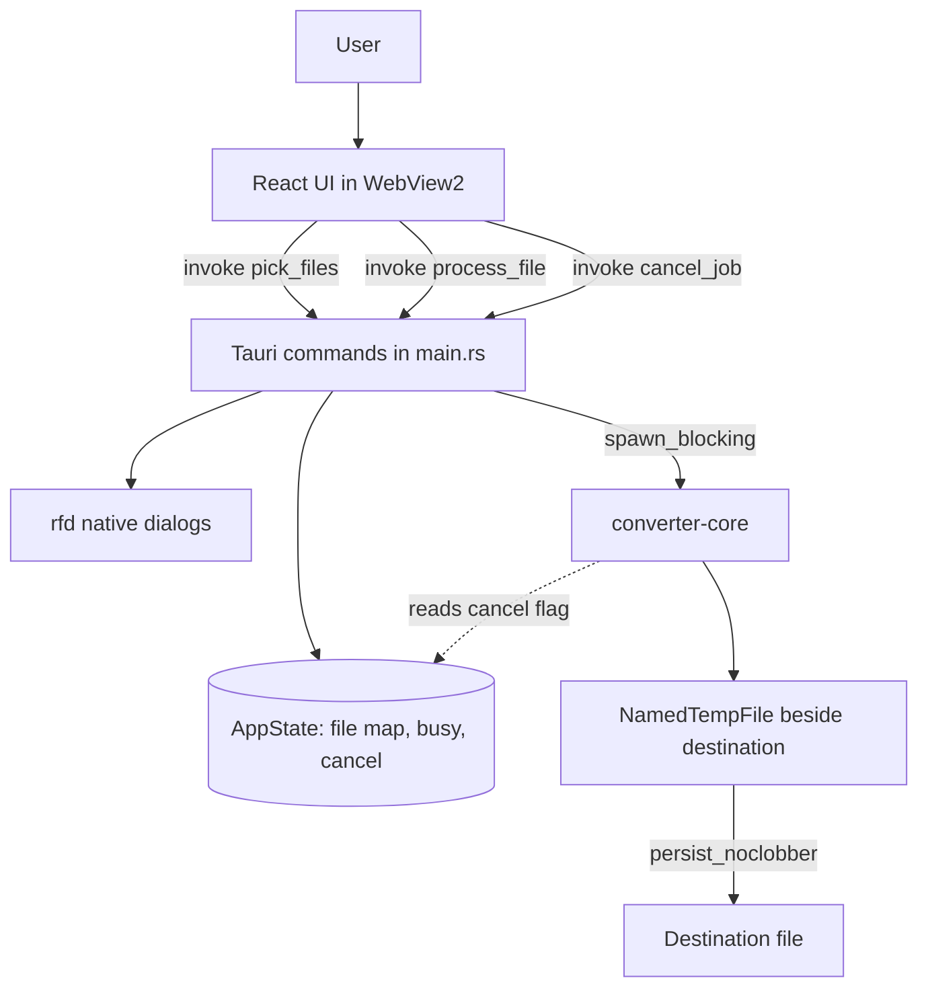

# Project Context

This document summarizes the current architecture and working assumptions for Doc Converter. It stays close to the implementation. It is not a product roadmap; the roadmap is in [`APPLICATION_PLAN.md`](APPLICATION_PLAN.md).

## How To Use This Document

Read this file first when starting non-trivial work.

- Use it to find the owning crate, command, or UI section and the likely feature doc.
- Do not treat it as a substitute for reading implementation files. The whole codebase is under 500 lines of Rust and TypeScript.
- If this file conflicts with code, trust code and update this file only when the mismatch affects your task.

For exported functions and commands, start at [`methods_report/README.md`](methods_report/README.md). For discovery, use [`index.md`](index.md).

## Overview

Doc Converter is a Windows-first Tauri 2 desktop app. It processes one local file at a time and never uploads anything. The first milestone ships three real operations:

- password-based `.age` encryption of any file
- authenticated `.age` decryption back to the original bytes
- static PNG/JPG/BMP image conversion to PNG or JPG, with resize and JPEG quality

Two more tabs, Documents and License, exist only as placeholders. They explain that LibreOffice, qpdf, and the licensing service are not connected. Nothing is simulated.

## Source Of Truth

When documentation conflicts, trust implementation files first.

Highest-signal files:

- `crates/core/src/lib.rs` - the processing core: encrypt, decrypt, convert_image, temp-file commit, cancellation
- `apps/desktop/src-tauri/src/main.rs` - Tauri commands, app state, file dialogs, job gating
- `apps/desktop/src/main.tsx` - the whole React UI in one component
- `apps/desktop/src/style.css` - the whole stylesheet
- `apps/desktop/src-tauri/tauri.conf.json` - window, CSP, build paths
- `opendesign/mockups/document-converter/` - the accepted design reference

## Repository Layout

```text
Cargo.toml                       Workspace: crates/core + apps/desktop/src-tauri
crates/core/                     converter-core crate (no Tauri dependency)
apps/desktop/                    Vite + React + TypeScript frontend
apps/desktop/src-tauri/          doc-converter binary: Tauri shell and commands
apps/desktop/dist/               Built frontend embedded into the executable
design/                          Original canvas export and three artboards
opendesign/                      Accepted interactive design mockup and viewer
docs/                            This documentation set
target/                          Cargo build output (ignored)
```

## Runtime Architecture



Three layers:

- **Frontend** (`main.tsx`): holds the file list, the selected file, the active operation, form values, and the last message or error. It only sends opaque IDs and typed options to the backend.
- **Tauri shell** (`main.rs`): owns the path map, the busy flag, and the cancel flag. It runs the file picker and the save dialog, then hands the work to the core on a blocking thread.
- **Core** (`converter-core`): pure Rust functions over paths, a secret, and a cancel flag. It has no Tauri dependency, so it can be reused by a CLI or another shell later.

See [`JOB_LIFECYCLE.md`](JOB_LIFECYCLE.md) and [`IPC_AND_FILE_ACCESS.md`](IPC_AND_FILE_ACCESS.md).

## State Model

### Backend `AppState`

| Field | Type | Meaning |
| --- | --- | --- |
| `files` | `Mutex<HashMap<String, PathBuf>>` | Opaque ID to canonical path for every picked file |
| `next` | `AtomicU64` | Counter that mints the next ID, starting at `0` |
| `busy` | `AtomicBool` | `true` while `process_file` runs, including during the save dialog |
| `cancel` | `AtomicBool` | Set by `cancel_job`; reset to `false` at the start of each job |

The file map only grows. Removing a file in the UI does not remove it from the map. Entries live until the process exits.

### Frontend state

All state is React `useState` inside one `App` component. There is no store, router, or persistence. Passwords live in state only until the job finishes or the operation changes.

## Conventions

- Rust edition 2021, `cargo fmt` clean. Errors are `converter_core::Error` in the core and `String` at the command boundary.
- User-facing error text is a complete sentence with the recovery action, for example `Output already exists. Choose another name.`
- The frontend is deliberately compact. One file, one component, one stylesheet. Split only when a real boundary appears.
- Operation identifiers are plain strings shared by both sides: `"image"`, `"encrypt"`, `"decrypt"`. The UI also knows `"documents"` and `"license"`, which the backend rejects.

## Behavioral Contracts

These runtime constraints are not visible from types alone.

| Symbol | Contract |
| --- | --- |
| `process_file` | Only one job at a time. It swaps `busy` to `true` first and always resets it, even when the save dialog is cancelled or the core fails. |
| `cancel_job` | Sets a flag only. The running stage finishes first. It never deletes an already committed output. |
| `output()` | Rejects an existing destination and creates the temporary file in the destination's parent directory. |
| `commit()` | Re-checks cancel, calls `sync_all`, then `persist_noclobber`. A destination created between the check and the commit makes the job fail without overwriting. |
| `decrypt` | Only passphrase (`scrypt`) age files. Plaintext reaches the destination only after the whole stream authenticates. |
| `convert_image` | Sniffs the real format from bytes, not the extension. Rejects APNG, images over 16000 px on a side, and decodes over 256 MiB. |
| Password length | The backend requires at least 12 Unicode scalar values for encrypt only. The UI enforces the same rule plus a confirmation match. Decrypt needs a non-empty password in the UI only. |
| Source files | Never opened for writing. Tests assert the source bytes are unchanged after conversion. |

## Documentation Expectations

When behavior changes:

1. Update the relevant feature doc in `docs/` in the same task.
2. Update `docs/methods_report/` if an exported function, command, or its signature changed.
3. Update `IMPLEMENTATION_STATUS.md` when a milestone lands or a listed gap closes.

## Debugging Notes

- Run `cargo run -p doc-converter` from the repo root with `pnpm dev` running in `apps/desktop`. The window loads `http://localhost:1420`.
- The production window title is `Doc Converter — Development`. Bundling is disabled in `tauri.conf.json`, so there is no installer.
- Open the WebView2 devtools in a debug build with F12 or Ctrl+Shift+I to see invoke errors as `String` rejections.
- Core behavior is easiest to test with `cargo test -p converter-core`. No window is needed.

## Common Pitfalls

- The browser preview at `localhost:1420` cannot process files. `isTauri()` is false there and the buttons are disabled.
- `cancel_job` after a job has finished leaves `cancel` at `true` until the next job starts, which resets it. Do not read the flag outside a job.
- Removing a file in the UI and picking it again creates a new ID. Old IDs still resolve.
- Suggested output names use the source file name, so encrypting `report.docx` proposes `report.docx.age`. That reveals the original name.
- The app CSS copies the mockup colours but not the IBM Plex font stack. It uses Segoe UI only.
