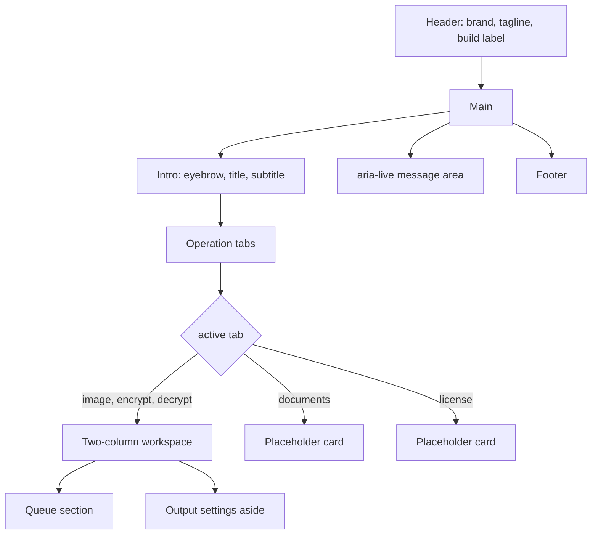

# Workspace UI

The whole interface is one React component, `App`, in `apps/desktop/src/main.tsx`, styled by `apps/desktop/src/style.css`. It follows the accepted design's one-window layout: files on the left, output settings on the right, one primary action. See [`DESIGN_REFERENCE.md`](DESIGN_REFERENCE.md) for the source.

## Layout

The grid is `minmax(0,1fr) 340px`. Below 850 px it collapses to one column and the header tagline hides.

## Operation tabs

| Tab | Operation ID | Status |
| --- | --- | --- |
| Images | `image` | Working |
| Encrypt | `encrypt` | Working |
| Decrypt | `decrypt` | Working |
| Documents | `documents` | Placeholder |
| License | `license` | Placeholder |

Tabs use `aria-pressed` and are disabled during a job. Switching a tab clears both password fields, the message, and the error. The file list and selection are kept.

The accepted design has four tabs: Convert, Images, Encrypt, Decrypt. The app renames Convert to Documents until an engine exists and adds License, which the design does not show.

## Settings aside

The heading changes with the operation: `Convert an image`, `Protect a file`, `Restore your file`. Controls per operation:

- **Images**: output format, resize bound, JPG quality slider. See [`IMAGE_CONVERSION.md`](IMAGE_CONVERSION.md).
- **Encrypt**: info box, password with Show/Hide, confirm password, hint, mismatch error. See [`ENCRYPTION.md`](ENCRYPTION.md).
- **Decrypt**: info box, single password with Show/Hide.

Below the controls:

- an unsupported-file error when the selected file's extension does not match the operation
- the action block: a hint about saving a new copy, the primary button, and a Cancel button while busy

## Primary action

The button label is `Convert image →`, `Encrypt file →`, or `Decrypt file →`, and `Working…` while busy. It is enabled only when all of these hold:

- running inside the desktop app
- no job is running
- a file is selected and its extension suits the operation
- for encrypt: password has at least 12 code points and equals the confirmation
- for decrypt: password is not empty

## Messages

One `aria-live="polite"` region under the workspace shows at most one notice and one error:

- notice, green box: job start hint, `Saved …`, or `Save cancelled …`
- error, red box with `role="alert"`: any rejected invoke or unsupported file

Selecting another file clears both. See [`JOB_LIFECYCLE.md`](JOB_LIFECYCLE.md) for the exact strings.

## Placeholder tabs

**Documents** says LibreOffice and qpdf are not connected, lists the missing features (PDF conversion, merging, page breaks, landscape, PDF passwords), and points to the opendesign folder.

**License** says no activation service is configured, no server is contacted, and asks the user not to enter a purchased key. It also states that recovery and decryption will stay available without a paid entitlement, which matches plan section 14.5.

Neither tab has controls. They exist so the tab bar already matches the intended product shape.

## Browser preview

`isTauri()` gates native calls. In a plain browser the page shows `Browser preview — open the desktop application to select and process local files.` and disables Add and the primary action. Everything else renders, so layout work can happen with `pnpm dev` alone.

## Accessibility

- Tabs and toggles carry `aria-pressed`.
- The queue is a radio group; remove buttons have `aria-label`.
- Focus ring is a 3 px `#73a391` outline with offset, the same as the mockup.
- Error text uses `role="alert"`; the message region is `aria-live`.
- No keyboard shortcuts beyond native tab order.

## Style tokens

The stylesheet uses literal colours copied from the mockup rather than CSS variables:

| Role | Value |
| --- | --- |
| Page background | `#f4f3f0` |
| Ink | `#262923` |
| Muted text | `#686c63` |
| Border | `#e2e4dc`, controls `#d7dcd2` |
| Accent green | `#2f6f5e`, hover `#245548` |
| Tint | `#edf3ee` |
| Error red | `#a33b2f` |
| Focus | `#73a391` |

Font is `Segoe UI`. The brand mark uses Georgia. Introducing the mockup's `--bg`, `--ink`, `--green` variables would be a safe first refactor.
