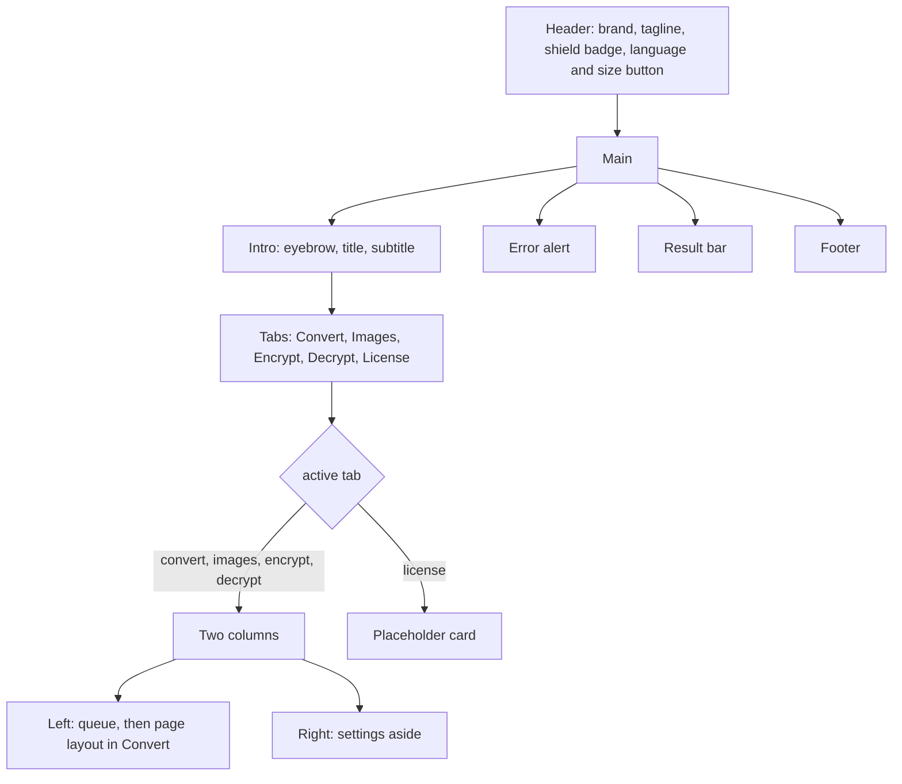

# Workspace UI

The interface is one React tree: `App` in `apps/desktop/src/App.tsx`, the PDF preview in `Preview.tsx`, typed backend calls in `api.ts`, every visible string in `i18n.ts`, and the stylesheet `style.css`, which is the mockup's stylesheet with CSS variables plus the additions below. It follows the accepted design: files on the left, output settings on the right, one primary action.

## Layout

The grid is `minmax(0,1fr) 344px` (360px above 1400px). Below 760px it collapses to one column.

## Header

The right side of the header holds the shield badge `Processed on this computer` and the `Aa` button. The button opens a small panel with two selects: *Language* (English, Hrvatski) and *UI scale* (90 %, 100 %, 110 %, 125 %, 150 %). The panel closes on an outside click or Escape. Below 1050 px the badge keeps only its shield icon. The old `Development build` label is gone; the build number stays in the footer.

## Language and scale

`i18n.ts` holds one table per language keyed by stable identifiers, with plural forms separated by `|`. `translate` fills `{name}` placeholders; `translatePlural` picks the form for a count using English rules or the Croatian one-few-many rule. Every label, hint, aria-label and status word in the app goes through these two functions, so adding a language means adding one table that TypeScript forces to be complete.

Backend messages are English. The UI translates the status details it knows (`Queued`, `Working…`, `Saved`, `Converting to PDF…`, `Ready to merge`, `Combined`, the cancel message) and shows any other backend text as sent, for example error messages from LibreOffice or lopdf.

The first language comes from the browser locale (`hr*` selects Croatian, everything else English). The chosen language and scale are the only persisted preferences; they live in the webview's `localStorage` under `doc-converter-language` and `doc-converter-scale`, read and written inside `try/catch`, and are applied again at startup.

UI scale uses the webview zoom (`getCurrentWebview().setZoom`), which scales the whole page like Ctrl and plus, so the pixel-based design stays in proportion. In a plain browser the page falls back to CSS `zoom`. The capability file grants `core:webview:allow-set-webview-zoom` for this.

## Tabs

| Tab | Mode | What it does |
| --- | --- | --- |
| Convert | `convert` | Document conversion, merge, PDF protection, page layout |
| Images | `images` | Image conversion |
| Encrypt | `encrypt` | Protected PDF or `.age` file |
| Decrypt | `decrypt` | Unlock PDF or restore `.age` |
| License | `license` | Placeholder card; no controls |

Switching a tab clears both password fields, the error, the result bar, and finished row statuses. Rows and their selection are kept. Tabs are disabled during a job.

## Settings column per mode

- **Convert**: batch format select; *Password-protect PDFs* switch; *Combine into one document* switch with the output filename; page orientation (As is, Portrait, Landscape). See [`DOCUMENT_CONVERSION.md`](DOCUMENT_CONVERSION.md).
- **Images**: format select, quality slider, resize select, transparency note. See [`IMAGE_CONVERSION.md`](IMAGE_CONVERSION.md).
- **Encrypt**: protection type radio cards. **Decrypt**: info card. See [`ENCRYPTION.md`](ENCRYPTION.md).
- **Password block** (Encrypt, Decrypt, or Convert with protection on and a PDF output among the selected rows or a merge): password with Show/Hide; confirm field, mismatch error and warning except in Decrypt.
- **Destination card**: `Choose a location when saving.`, or the folder wording when several files are selected.
- **Action area**: summary `N documents ready` and the output type (`PDF`, `Mixed formats`, `1 combined PDF`, `Protected PDF`, `Encrypted copy`, `Restored copy`); the primary button; Cancel while busy; a note counting skipped files and unreachable formats.

## Primary action

The label is `Convert N files`, `Combine into one PDF`, `Convert images`, `Protect PDFs`, `Encrypt files` or `Decrypt files`, and `Working…` while busy. It is enabled only when all of these hold:

- running inside the desktop app
- no job is running
- at least one selected row is eligible for the mode
- the password rule holds when a password is needed
- in Convert, every selected row targets a format it can reach, and a merge has a name

## Page layout panel

Shown in Convert when a selected row targets PDF or DOCX or when combining. Contents: preview document select or the merge order list, margins and spacing selects, the outline with a checkbox per block, *Reset page breaks*, the count badge, and the rendered pages. See [`PAGE_LAYOUT.md`](PAGE_LAYOUT.md).

## Result bar

Appears when a job starts: `Choose where to save the new files.`, then `Processing your files…` with `k of n: detail` and a progress element counting finished rows, then a summary such as `2 files saved · 1 failed · C:\…\first output`. Cancel is available while running; Dismiss afterwards. A dismissed save dialog shows `Save cancelled`.

## Messages

- One `role="alert"` red box under the workspace for command errors (picker, drop, start failures).
- The result bar stores codes, not sentences, so switching the language re-renders it in the new language.
- Per-row errors stay in the status column with the message as tooltip.
- The queue footer line shows the engine state: `Checking engines…`, `LibreOffice 26.8 · ready`, or `LibreOffice not found · Office conversions unavailable`.

## Browser preview

`isTauri()` gates native calls. In a plain browser the page shows `Browser preview — open the desktop application to select and process local files.` and disables Add and the primary action.

## Accessibility

- Tabs, orientation buttons and switches carry `aria-pressed` or `role="switch"`.
- Row checkboxes, format selects and remove buttons have labels that include the file name.
- Focus ring is a 3 px `#73a391` outline with offset.
- The result bar is `aria-live="polite"`; errors use `role="alert"`.
- Reduced motion disables transitions.

## Style tokens

CSS variables on `:root`, taken from the mockup:

| Token | Value |
| --- | --- |
| `--bg` | `#f4f3f0` |
| `--ink` | `#262923` |
| `--muted` | `#686c63` |
| `--line` | `#e2e4dc` |
| `--green`, `--green-dark` | `#2f6f5e`, `#245548` |
| `--tint` | `#edf3ee` |
| `--amber` | `#8c5b24` |
| `--red` | `#a33b2f` |

Additions beyond the mockup: `.topbar-right`, `.local-badge .shield`, `.prefs-button` and `.prefs-panel`, `.status.failed`, `.status.working`, `.outline` and `.outline-row`, canvas-based `.page-sheet`, `.merge-order`, the three-button `.orientation` grid, `.file-type.age`, and `.dragging` for the window-wide drop highlight.
